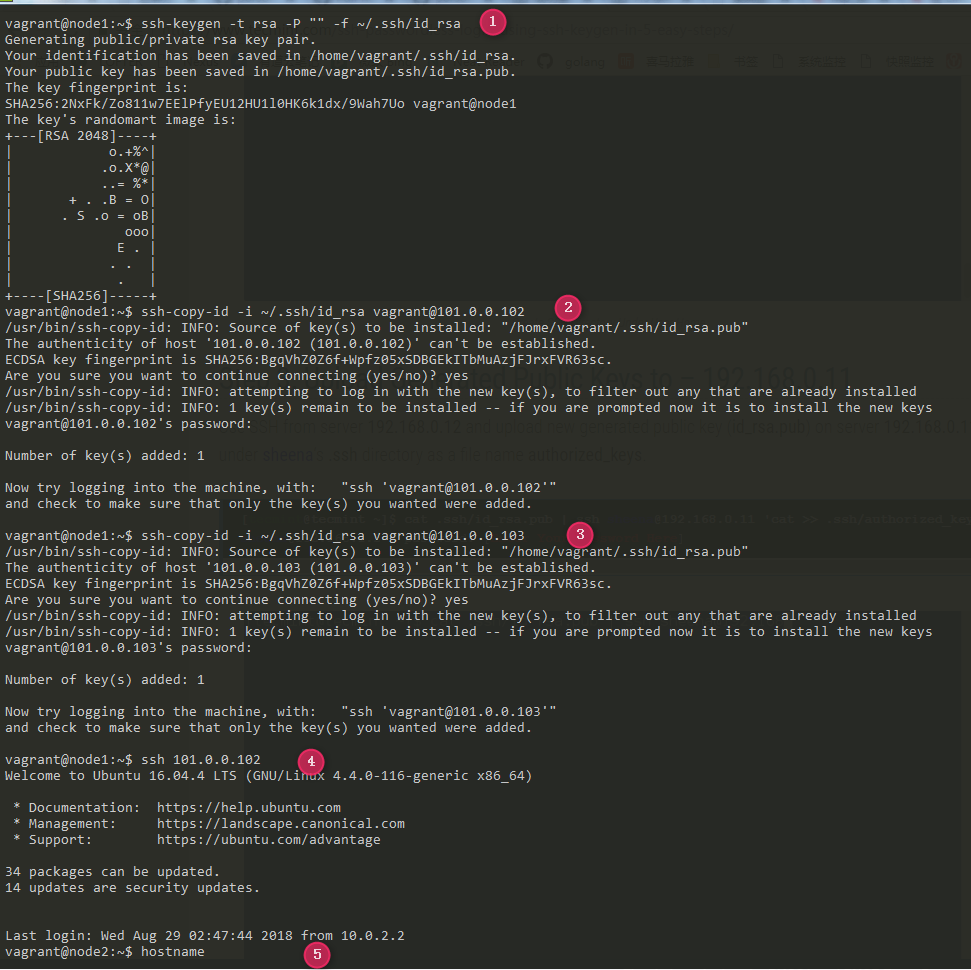
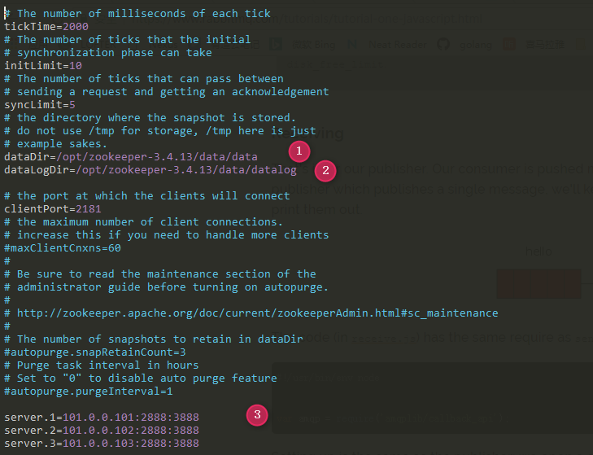
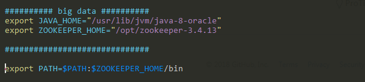

# Hadoop

本文主要是总结如何进行**Hadoop**集群的搭建，其中，我也参考了很多其他人的总结资料，在此表示感谢，并且为了保持本文的简短性，对所有参考过的资料不一一列出，望见谅！

本**Hadoop**集群是在`Linux Ubuntu 16.04 x64`上进行搭建的。

```sh
root@node1:~# cat /etc/issue
Ubuntu 16.04.3 LTS \n \l
root@node1:~# uname -a
Linux node1 4.4.0-104-generic #127-Ubuntu SMP Mon Dec 11 12:16:42 UTC 2017 x86_64 x86_64 x86_64 GNU/Linux
```

我们共使用3台servers，他们在Hadoop HA集群中的角色如下表

| server | IP addr     | role      | role        | role     | role     | role            |
| ------ | ----------- | --------- | ----------- | -------- | -------- | --------------- |
| node1  | 101.0.0.101 | ZooKeeper | NodeManager | DataNode | NameNode |                 |
| node2  | 101.0.0.102 | ZooKeeper | NodeManager | DataNode | NameNode | ResourceManager |
| node3  | 101.0.0.103 | ZooKeeper | NodeManager | DataNode |          | ResourceManager |


### JDK

安装JDK1.8,为了确保不会出现`JPS无法找到的问题`，我们安装Oracle JDK8

```sh
$ sudo add-apt-repository ppa:webupd8team/java -y
$ sudo apt-get update
$ sudo apt-get install oracle-java8-installer -y
```

安装好后，我们确认一下最后的结果

```sh
root@node1:~# java -version
java version "1.8.0_181"
Java(TM) SE Runtime Environment (build 1.8.0_181-b13)
Java HotSpot(TM) 64-Bit Server VM (build 25.181-b13, mixed mode)

```

设置**JAVA_HOME**环境变量

```sh
$ export JAVA_HOME='/usr/lib/jvm/java-8-oracle'
```


### ssh passwordless

此处以在node1上的ssh配置步骤为例，node2和node3上需要进行类似的操作




### NTP

参见本repo中关于NTP的部分，在此不再赘述。


### Zookeeper

在node1,node2,node3上都安装Zookeeper

```sh
$ mkdir /tmp/download
$ cd /tmp/download
$ wget http://mirrors.shu.edu.cn/apache/zookeeper/zookeeper-3.4.13/zookeeper-3.4.13.tar.gz
```

将其解压到`/opt`目录下

```sh
$ sudo tar xzvf zookeeper-3.4.13.tar.gz -C /opt/
$ sudo chown vagrant:vagrant -R /opt/zookeeper-3.4.13
```

创建相关目录，用于存放Zookeeper运行时文件

```sh
$ sudo mkdir -p /opt/zookeeper-3.4.13/datat/data /opt/zookeeper-3.4.13/datat/datalog
```

- data/data 存放Zookeeper快照日志
- data/datalog 存放Zookeeper事务日志  

配置Zookeeper

```sh
$ cd /opt/zookeeper-3.4.13/conf
$ cp zoo_sample.cfg zoo.cfg
$ vim zoo.cfg
```



在各个服务器上创建对应的myid文件

```sh
vagrant@node1: echo 1 > /opt/zookeeper-3.4.13/data/data/myid
```

```sh
vagrant@node2: echo 2 > /opt/zookeeper-3.4.13/data/data/myid
```

```sh
vagrant@node3: echo 3 > /opt/zookeeper-3.4.13/data/data/myid
```

编辑**~/.bashrc**文件



在每台server上启动Zookeeper

```sh
$ zkServer.sh start
```

可以通过**zkCli.sh**进行验证Zookeeper是否工作正常。