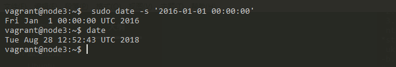

# NTP服务搭建

本文总结在ubuntu上搭建NTP服务的相关步骤。<br><br> 因为集群(cluster)的正确运行需要可信赖的NTP服务，又因为集群(cluster)往往不连接外网，所以，就需要自行搭建一个内部使用的NTP服务，本文正是出于此目的而写的。

### Ubuntu

我们有三台ubuntu的服务器，每台的系统信息如下

```sh
vagrant@node2:~$ cat /etc/issue; uname -a
Ubuntu 16.04.4 LTS \n \l

Linux node2 4.4.0-116-generic #140-Ubuntu SMP Mon Feb 12 21:23:04 UTC 2018 x86_64 x86_64 x86_64 GNU/Linux
vagrant@node2:~$

```

对应的IP地址

| server                                      | IP          |
| ------------------------------------------- | ----------- |
| node1 <font color="red">(NTP server)</font> | 101.0.0.101 |
| node2                                       | 101.0.0.102 |
| node3                                       | 101.0.0.103 |

### 安装 ntp

在每台server上都安装**ntp** 和 **ntpdate**

```sh
$ sudo apt-get install ntp ntpdate -y
```

在node1<font color="red">(NTP Server)</font>上配置/etc/ntp.conf

```sh
$ vim /etc/ntp.conf
```


> 请注意我们设置了如下的网段
>
> restrict 101.0.0.0 mask 255.255.255.0 nomodify notrap
>
> 其中，101.0.0.0 是我们内容的网段

配置好后，重启ntp服务

```sh
$ sudo service ntp restart
```

查看ntp是否工作正常

```sh
$ sudo ntpq -c lpeer
```


```sh
$ sudo tail -f /var/log/syslog
```

在node2,node3上配置cron任务

```sh
$ crontab -e

*/10 * * * * /usr/sbin/ntpdate 101.0.0.101
```


### 测试

